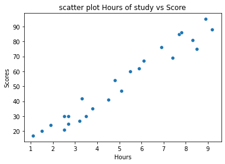
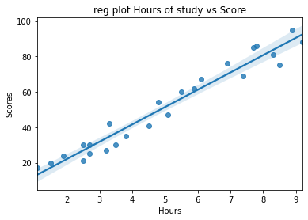

[website view](https://tejas-python.github.io/Spark-foundation-intern-tasks/Task%201/)


# TASK1
Prediction using Supervised ML

(Level - Beginner)

● Predict the percentage of an student based on the no. of study hours.

● This is a simple linear regression task as it involves just 2 variables.

● You can use R, Python, SAS Enterprise Miner or any other tool

● Data can be found at http://bit.ly/w-data

● What will be predicted score if a student studies for 9.25 hrs/ day?

## Libraries
```python
import pandas as pd 
import seaborn as sns
import matplotlib.pyplot as plt
import numpy as np 
%matplotlib inline 
```

## Graphs
### Scatter plot


### REG plot 


## Prediction for 9.5 hours

```python
hours = np.array([9.25]).reshape(-1,1)
pred = reg.predict(hours)
print("No of Hours = {}".format(hours))
print("Predicted Score = {}".format(pred[0]))
```

## Output

```output
No of Hours = 9.25
Predicted Score = 93.19193983 %
```
# Links
[Note book link](https://github.com/tejas-python/Spark-foundation-intern-tasks/blob/master/Task%201/Task1.ipynb)
[Download .ipynb](https://tejas-python.github.io/Spark-foundation-intern-tasks/task1)