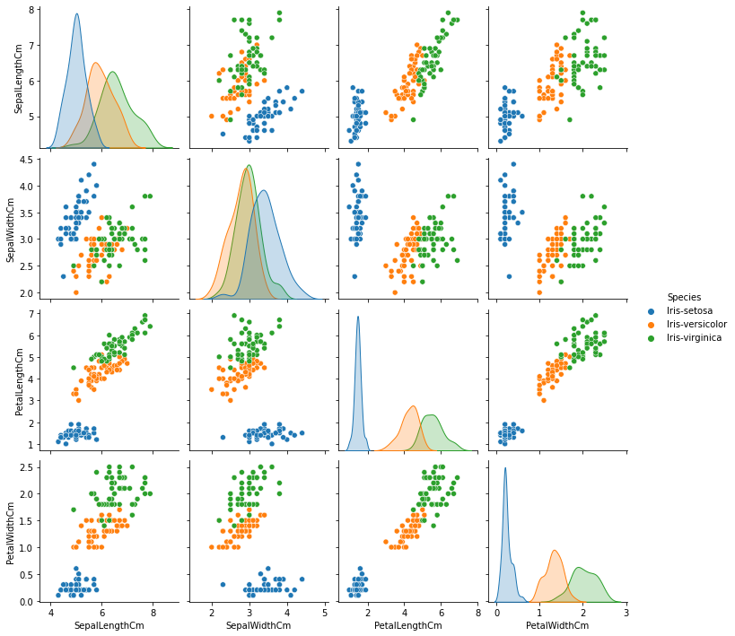
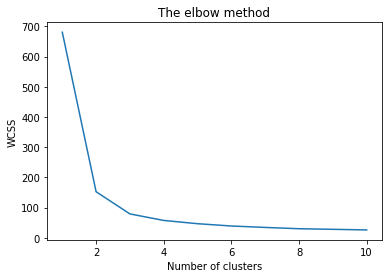
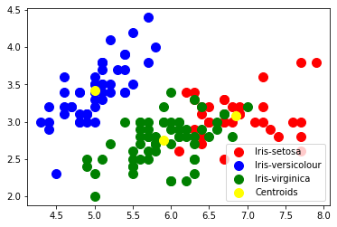

# TASK 2
Prediction using Unsupervised ML

(Level - Beginner)

● From the given ‘Iris’ dataset, predict the optimum number of clusters
and represent it visually.

● Use R or Python or perform this task

● Dataset : https://bit.ly/3kXTdox

## Libraries
```python
import pandas as pd 
import seaborn as sns
import matplotlib.pyplot as plt
import numpy as np 
%matplotlib inline 
```
# Graphs 
### pair plot

### elbow 


### Chosing k =3 from the above elbow curve 
```python
kmeans = KMeans(n_clusters = 3, init = 'k-means++', max_iter = 300, n_init = 10, random_state = 0)


y_kmeans = kmeans.fit_predict(x)
```


# Links 
[Note book]()

[Download link]()