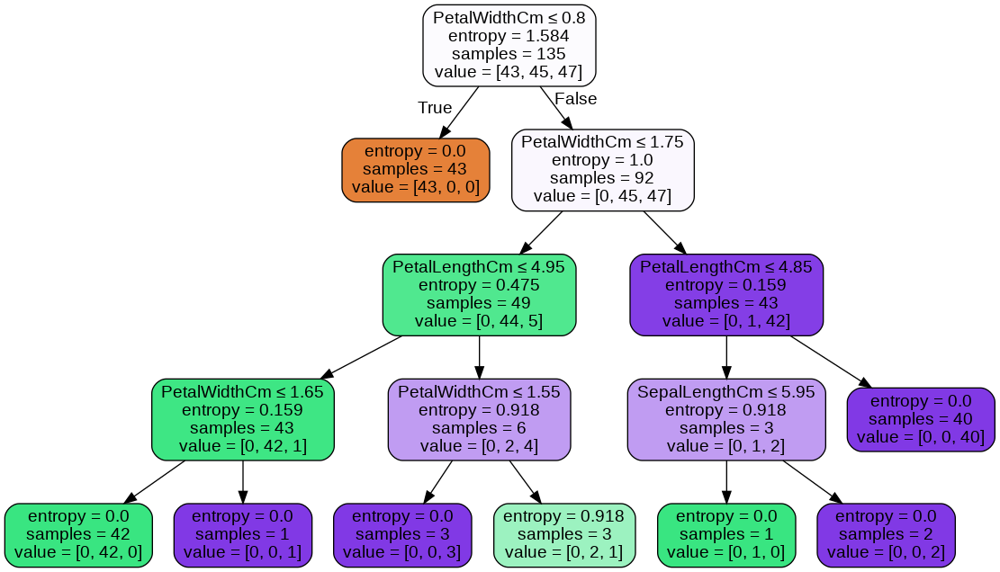

# TASK 6
Prediction using Decision Tree

Algorithm
(Level - Intermediate)

● Create the Decision Tree classifier and visualize it graphically.

● The purpose is if we feed any new data to this classifier, it would be able to
predict the right class accordingly.

● Dataset : https://bit.ly/3kXTdox

## Libraries
```python
import pandas as pd 
import seaborn as sns
import matplotlib.pyplot as plt
import numpy as np 
from sklearn.tree import DecisionTreeClassifier
%matplotlib inline 
```
# Decision Tree classifier


# Links
[Note book link ]()

[download link]()